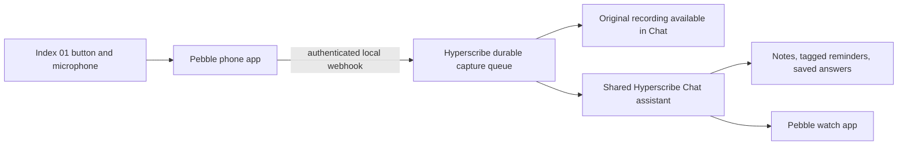

# Pebble and Index setup — Hyperscribe Mobile 2.9.7

## What is connected

This implementation receives recordings through the installed Pebble companion. It does not require a public server or MCP service. The receiver binds only `127.0.0.1:18765`, requires an installation-specific bearer credential, and optionally verifies Pebble’s signed multipart payload. The private credential and recovery journal are excluded from Android backups. New received recordings stay in the private journal and are playable from Chat; processing does not create raw Inbox copies. Original ring audio is local to this device and is not included in Chat exports or portable backups.

## Phone setup

1. In Hyperscribe, open **Settings → Readiness → Set up Index ring & Pebble watch**.
2. Tap **Start receiver** and wait for **Listening**. This includes receiver status in the shared Hyperscribe controls notification and enables recovery after ordinary process restarts and phone reboots.
3. Copy the webhook URL. In Pebble, open **Index → Settings → Ring Button → Hold & Talk → Webhook only** and open its webhook settings. Labels may vary by companion version.
4. Paste `http://127.0.0.1:18765/index` as the URL.
5. Add a custom header named **Authorization**. Use **Copy Authorization value** in Hyperscribe and paste the complete `Bearer …` value.
6. Prefer **Recording only**. This delivers audio before Pebble’s transcription and lets Hyperscribe preserve the recording while offline. “Both” and text-only depend on Pebble transcription completing first.
7. If the installed Pebble settings offer request signing, copy Hyperscribe’s signing secret into that field. The same installation token is used for HMAC verification. Keep the Authorization header enabled as well.
8. Send Pebble’s test event. A successful test verifies delivery without creating a note. Record a short real note next and confirm the conversation appears in Chat and its completed note appears once in Inbox.

Hyperscribe uses the transcription provider/fallback and text replacement settings already selected in the app. Check those credentials if a recording needs attention. **Retry saved imports** resumes blocked work after settings are corrected.

## Watch setup

In the same screen, tap **Install Pebble watch app**, complete Pebble’s installation flow, then **Test watch display**. The bundled native watch app supports Pebble 2 Duo (`flint`) and Pebble Time 2 (`emery`).

Use Up/Down to scroll, Select for options, and hold Select for the previous page. Select **Read with TTS** to hear the saved response through the phone or connected headphones while the phone stays locked; **Stop reading** cancels that reading. Next/previous page options remain in the same menu. Normal mirrored Chat notifications also expose **Read with TTS** and **Stop reading**. For Index replies, Hyperscribe first tries the custom watch display. Once that exact reply is acknowledged, the phone notification is marked phone-only to avoid a second watch alert. If custom delivery is unconfirmed or fails, the phone notification remains mirrorable as a fallback. Pebble normally honors phone-only notifications; its advanced **send local-only notifications** override must remain disabled to preserve this behavior. Install the updated watch app once to get the new menu. Hyperscribe keeps the latest response for reopening/reconnection. The phone reports **displayed** only after the watch acknowledges the matching response and page; a Bluetooth transport acknowledgement alone is insufficient. The complete conversation stays in Chat even if the watch is unavailable. Completed notes, reminders, and librarian answers appear in Inbox.

New replies use plain text on the watch and in notification previews. Headings and emphasis keep their words without Markdown delimiters; links show their labels; tables become labeled rows. Chat retains the original formatting and links. Read with TTS still targets the original saved message. This phone-side change works with watch app 0.2.0. A response cached before this update retains its previous display text until a new response replaces it.

### If a bell notification covers the full watch response

In the Pebble phone app, search Settings for **local-only** and turn **Send local-only notifications to watch** off (Phone → Notifications). This override can forward Hyperscribe's phone-only notification even after successful custom-watch delivery. Dismiss the existing bell notification and test a new ring request after changing the setting.

If the override is already off, check whether the custom display acknowledgment was missing: an unconfirmed delivery still intentionally enables the standard notification fallback. Do not infer acknowledgment failure solely from the two displays.

## Requests

| Say or type | Result |
|---|---|
| “Remind me to update the calendar later today at 2.” | Calendar reminder at 2 PM today when still in the future; otherwise asks for a future time. |
| “Remind me to process payroll tomorrow at 3.” | “Process payroll” reminder tomorrow at 3 PM; Work tag when that tag exists and auto-tagging is enabled. |
| “Remind me in three days to do XYZ.” | Reminder interpreted from the capture date and timezone. |
| “Make a note of the deployment checklist.” | New Inbox note. |
| Ordinary ring dictation without a command | New note containing the dictation. |
| “How often do I use the word turbulence?” | Deterministic whole-word count over retained local authored captures, with scope and sources. |
| “Show my notes tagged Hyperscribe or containing Hyperscribe.” | Local tag/text search, saved answer, and watch response. |

Each ring capture has a stable request ID. A timing reply such as “tomorrow at 3” or “3 pm” continues the most recent pending reminder conversation within 30 minutes of the previous capture. Explicit new notes, reminders, or unrelated questions start a new thread; clear references to the previous response continue its recent thread. Say “new conversation” or “new topic” before a request to start fresh. A bare time without a pending reminder asks for the task in Chat instead of creating a time-only note.

For example: “Remind me tomorrow to buy bagels” → a time question in Chat → “3 pm” → one reminder titled “buy bagels,” due tomorrow at 3 PM. Both messages and both responses stay in the same Chat thread. Clarifications and ordinary conversational responses do not become Inbox items. You can also open that Chat thread and type the reply. Existing Inbox entries from older versions are preserved.

Chat labels Index messages and offers original-recording playback. Pending recordings remain visible in Chat before transcription is available. The setup screen also opens completed conversations. Captures process in their saved arrival order so a quick reply cannot overtake its earlier question.

Text replacements run once before interpretation; original speech remains available. Existing programmatic tag rules remain authoritative. Bounded semantic suggestions supplement those rules; optional background enrichment does not block saving or scheduling. Generated answers and input recordings for processed commands are excluded from the librarian’s authored-content counts to avoid counting the question itself.

## Delivery and recovery limits

- **Offline after receipt:** audio/text is saved before processing and HTTP acceptance. Background work retries transient provider failures; credential or invalid-request failures remain visible for manual retry. Stable IDs and persisted Chat receipts prevent duplicate notes/reminders after replay or interruption. A capture needing attention holds later captures in order; retry it after correcting settings, or delete that capture to release the queue.
- **Before receipt:** Pebble’s current webhook sender is best-effort and lacks a durable retry outbox. Hyperscribe cannot recover a request that Pebble never delivers. Keep the receiver enabled, and check received captures after an interruption. “Webhook only” should not be treated as a second archive in Pebble.
- **Phone restrictions:** force-stop prevents background work until Hyperscribe is opened again. Android background/battery policies can delay work; the visible receiver status is the useful check.
- **Audio limits:** the receiver accepts at most 16 MiB per HTTP body. The journal limits audio to 512 MiB and retains up to 2,048 capture/tombstone records. It reports capacity failures instead of acknowledging discarded data. Chat and setup expose saved captures. Deleting a capture or its original Chat request cancels/tombstones processing and frees its journal audio. Deleting older Inbox source recordings also cancels their processing.
- **Reminders:** the current app schedules reminders with WorkManager, so Android can delay the notification. This update preserves that scheduler; exact alarm delivery is not implemented. Ambiguous or elapsed times prompt for clarification rather than claiming a reminder was scheduled.
- **Watch storage:** the bridge retains the latest response, not a full independent watch library. Older results remain in the phone app.

## References

- [Index advanced features](https://help.repebble.com/en/articles/15724406-index-advanced-features-mcp-webhook)
- [Pebble companion source](https://github.com/coredevices/mobileapp)
- [Pebble Android communication guide](https://developer.repebble.com/guides/communication/using-pebblekit-android/)
- [SDK](https://developer.repebble.com/sdk/)

